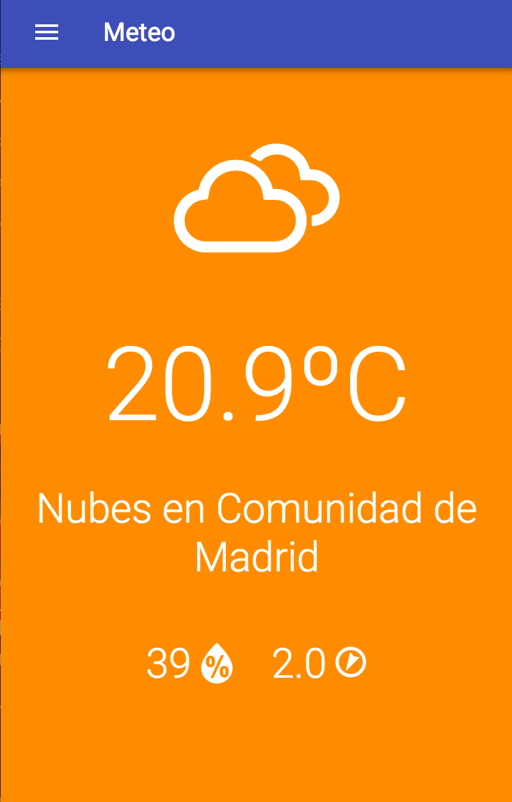

# Openweathermap Module
===================================


### Description


Module that displays weather information in a particular area.

### Screenshot


### Configuration for visualizer

You need an AppId from OpenWeatherMap. [Follow this steps](http://openweathermap.org/appid)

- app/core/structure.json
```json
"/menu-abcd/openweathermap": {
      "name": "Meteo",
      "identifier": "openweathermap",
      "type": "A",
      "icon": "assignment",
      "showOn": {
        "market": true,
        "dragDrop": true
      },
      "libs": [{
        "bower": {
          "weather-icons": "^2.0.10"
        },
        "src": ["bower_components/weather-icons/css/weather-icons.min.css", "bower_components/weather-icons/css/weather-icons-wind.min.css"]
        }, {
        "bower": {
          "angular-openweathermap-api-factory": "^0.5.0"
        },
        "src": "bower_components/angular-openweathermap-api-factory/dist/angular-openweathermap-api-factory.min.js"
      }],
      "view": "modules/openweathermap/index.html",
      "files": ["modules/openweathermap/controller.js", "modules/openweathermap/style.html"],
      "scope": {
        "appid": "<---- ID HERE ---->",
        "units": "metric",
        "lat": "40.4262687",
        "lon": "-3.6662797"
      }
    }
```

### Special thanks

We created this module inspired from these libraries and examples

- [Current Local Weather](http://codepen.io/atamyo/pen/jAmQZK) by Angeline.
- [Local Weather App](https://codepen.io/r_christian/pen/NNKLNz) by Rachel Christian.
- [Angular Openweathermap Api Factory](https://github.com/JohnnyTheTank/angular-openweathermap-api-factory) by [Jonathan Hornung](https://github.com/JohnnyTheTank/).
- [Weather Icons](https://erikflowers.github.io/weather-icons/) by [Erik Flowers](https://github.com/erikflowers)


### Details:

- Author: Ulises Gascón
- Version: 0.0.1
- Homepage: https://github.com/KingofApp
